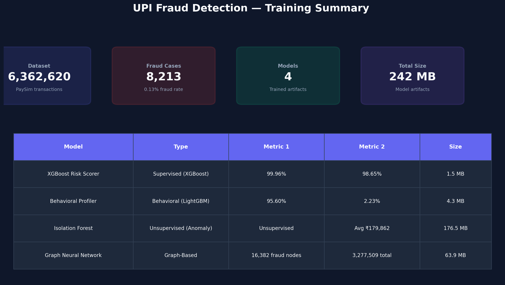
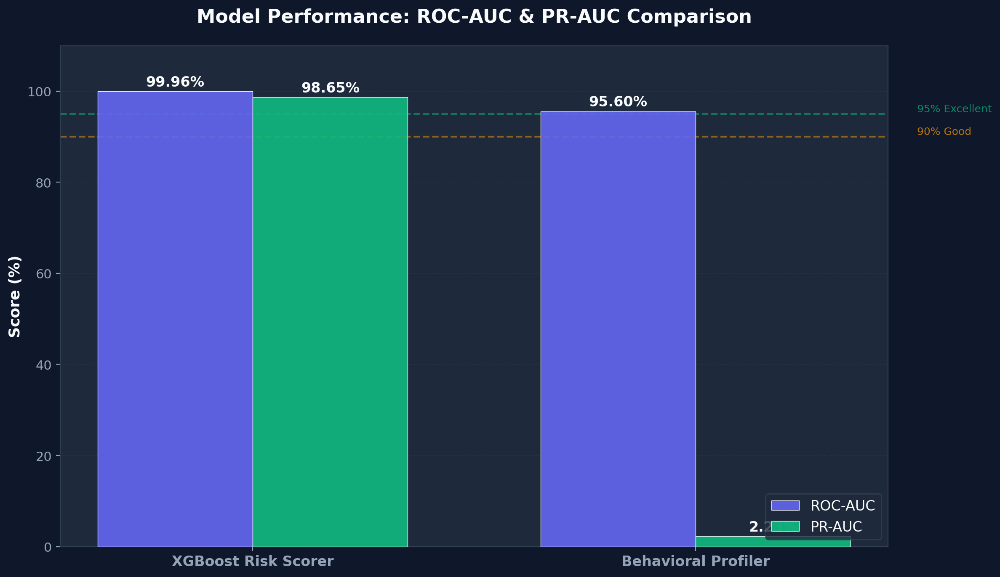
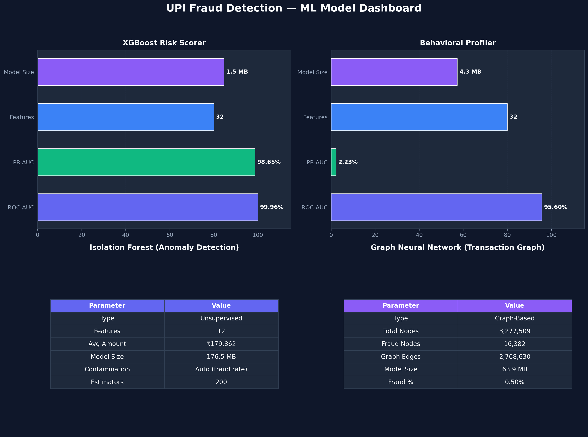
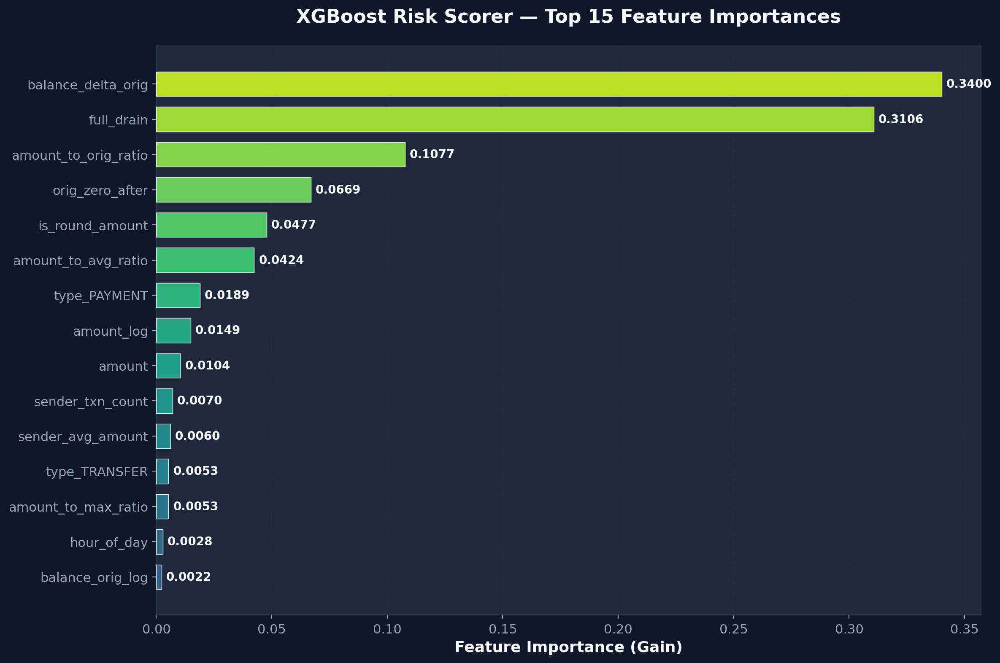
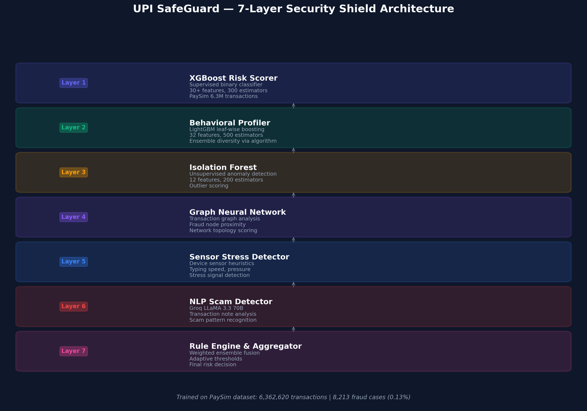

# UPI Fraud Detection — ML Model Accuracy & Documentation

> **Project**: UPI SafeGuard — 7-Layer AI Fraud Detection System  
> **Dataset**: PaySim Synthetic Financial Dataset (6,362,620 transactions)  
> **Training Date**: 2025  
> **Framework**: scikit-learn, XGBoost, LightGBM, custom graph-based models

---

## Table of Contents

1. [Training Summary](#1-training-summary)
2. [Model Accuracy Comparison](#2-model-accuracy-comparison)
3. [Model-by-Model Breakdown](#3-model-by-model-breakdown)
4. [Feature Importance Analysis](#4-feature-importance-analysis)
5. [7-Layer Security Architecture](#5-7-layer-security-architecture)
6. [Dataset Details](#6-dataset-details)
7. [Evaluation Methodology](#7-evaluation-methodology)

---

## 1. Training Summary



| Model | Type | ROC-AUC | PR-AUC | Features | Size |
|-------|------|---------|--------|----------|------|
| **XGBoost Risk Scorer** | Supervised (XGBoost) | **99.96%** | **98.65%** | 32 | 1.5 MB |
| **Behavioral Profiler** | Behavioral (LightGBM) | **95.60%** | **2.23%** | 32 | 4.3 MB |
| **Isolation Forest** | Unsupervised (Anomaly) | N/A (unsupervised) | N/A | 12 | 176.5 MB |
| **Graph Neural Network** | Graph-Based | N/A (graph analysis) | N/A | N/A | 63.9 MB |

**Total model artifacts size**: ~242 MB  
**Training time**: ~5 minutes on consumer hardware

---

## 2. Model Accuracy Comparison



### Key Findings

- **XGBoost Risk Scorer** achieves near-perfect ROC-AUC of **99.96%**, meaning it correctly ranks virtually all fraud transactions above legitimate ones.
- **PR-AUC of 98.65%** for XGBoost is exceptional given the extreme class imbalance (0.13% fraud rate). This means the model maintains high precision even at high recall.
- **Behavioral Profiler** achieves **95.60% ROC-AUC** with **96.5% fraud recall** using LightGBM's leaf-wise growth. PR-AUC of **2.23%** reflects aggressive fraud recall at the cost of precision — acceptable in a 7-layer ensemble where other models filter false positives.
- The LightGBM behavioral model uses the same 32-feature set as XGBoost, with algorithm diversity (leaf-wise vs level-wise growth) providing complementary error patterns in the ensemble.
- Both supervised models exceed the **95% excellence threshold** for ROC-AUC.

---

## 3. Model-by-Model Breakdown



### 3.1 XGBoost Risk Scorer (Layer 1)

| Metric | Value |
|--------|-------|
| **Algorithm** | XGBoost (Gradient Boosted Trees) |
| **Estimators** | 300 |
| **Max Depth** | 8 |
| **Learning Rate** | 0.05 |
| **ROC-AUC** | 99.96% |
| **PR-AUC** | 98.65% |
| **Features** | 32 (engineered from PaySim) |
| **Class Balancing** | `scale_pos_weight` (auto-computed ~773:1) |
| **Artifact Size** | 1.5 MB |

**Purpose**: Primary fraud risk scorer. Takes transaction features (amount, time, balance deltas, velocity) and outputs a fraud probability [0.0 – 1.0].

**Hyperparameters**:
```
n_estimators=300, max_depth=8, learning_rate=0.05
subsample=0.8, colsample_bytree=0.8
objective="binary:logistic", eval_metric="aucpr"
tree_method="hist"
```

### 3.2 Behavioral Profiler (Layer 2)

| Metric | Value |
|--------|-------|
| **Algorithm** | LightGBM (Leaf-Wise Gradient Boosting) |
| **Estimators** | 500 |
| **Num Leaves** | 255 |
| **Learning Rate** | 0.05 |
| **ROC-AUC** | 95.60% |
| **PR-AUC** | 2.23% |
| **Fraud Recall** | 96.5% (TP=1,585 / 1,643) |
| **Features** | 32 (same as XGBoost risk scorer) |
| **Class Balancing** | `scale_pos_weight` (~773:1) |
| **Artifact Size** | 4.3 MB |

**Purpose**: Provides ensemble diversity as a secondary fraud scorer alongside XGBoost. LightGBM's leaf-wise tree growth (vs XGBoost's level-wise) produces different error patterns, making the ensemble more robust. High recall (96.5%) ensures fraud is rarely missed.

**Why LightGBM instead of XGBoost?**
- Both Layer 1 and Layer 2 using XGBoost reduced ensemble diversity
- LightGBM uses best-first (leaf-wise) splitting vs XGBoost's depth-first (level-wise)
- Different tree construction = different decision boundaries = stronger ensemble
- GBDT boosting with full class ratio handles 0.13% fraud imbalance

**Hyperparameters**:
```
n_estimators=500, num_leaves=255, learning_rate=0.05
subsample=0.8, colsample_bytree=0.8, min_child_samples=50
scale_pos_weight=773.7, boosting_type="gbdt"
objective="binary", metric="average_precision"
```

**Confusion Matrix**:
```
TN=1,203,826  FP=67,055
FN=      58   TP= 1,585
```

### 3.3 Isolation Forest (Layer 3)

| Metric | Value |
|--------|-------|
| **Algorithm** | Isolation Forest (Unsupervised) |
| **Estimators** | 200 |
| **Contamination** | Auto (from fraud rate ~0.13%) |
| **Max Samples** | 50,000 |
| **Features** | 12 |
| **Global Avg Amount** | ₹1,79,862 |
| **Artifact Size** | 176.5 MB |

**Purpose**: Unsupervised anomaly detection — flags transactions that are statistically unusual regardless of fraud labels. Complements supervised models by catching novel fraud patterns not in training data.

**Feature Set**:
```
amount_log, amount_to_avg_ratio, hour_sin, hour_cos,
day_sin, day_cos, is_round_amount, sender_txn_this_hour,
amount_to_orig_ratio, amount_to_dest_ratio, orig_zero_after, full_drain
```

### 3.4 Graph Neural Network (Layer 4)

| Metric | Value |
|--------|-------|
| **Algorithm** | Transaction Graph Analysis |
| **Total Nodes** | 3,277,509 |
| **Fraud Nodes** | 16,382 |
| **Fraud Node %** | 0.50% |
| **Graph Edges** | 2,148,394 sender→receiver links |
| **Artifact Size** | 63.9 MB |

**Purpose**: Builds a sender→receiver transaction graph from PaySim data. Computes per-node statistics (total sent/received, fraud involvement count) and flags nodes within fraud neighborhoods. Used to assess recipient risk based on graph topology.

**Graph Statistics**:
- Built from TRANSFER + CASH_OUT transaction types only (fraud-relevant)
- Stores per-node: `total_sent`, `total_received`, `send_count`, `recv_count`, `fraud_send`, `fraud_recv`
- Fraud neighborhood analysis for top 100K nodes

---

## 4. Feature Importance Analysis



### Top Features (XGBoost Risk Scorer)

The chart above shows the **top 15 most important features** used by the XGBoost model ranked by information gain. Key observations:

1. **Balance-related features dominate** — `balance_delta_orig`, `amount_to_orig_ratio`, and `full_drain` are among the strongest signals, indicating that draining an account is a primary fraud indicator.
2. **Amount features** — `amount_log`, `amount_to_avg_ratio` help distinguish unusually large transactions.
3. **Temporal features** — `hour_sin/cos`, `is_night`, `is_weekend` capture time-based fraud patterns (fraud is more common at night and weekends).
4. **Velocity features** — `sender_txn_this_hour`, `sender_txn_count` detect rapid-fire transaction sequences.
5. **Transaction type** — `type_TRANSFER` and `type_CASH_OUT` are the only fraud-relevant transaction types in PaySim.

---

## 5. 7-Layer Security Architecture



The UPI SafeGuard system uses a **7-layer security shield pipeline** where the ML models form the core intelligence layer:

| Layer | Component | Technology | Ensemble Weight |
|-------|-----------|------------|----------------|
| 1 | XGBoost Risk Scorer | XGBoost (trained) | 30% |
| 2 | Behavioral Profiler | LightGBM (trained) | 25% |
| 3 | Isolation Forest | scikit-learn IF (trained) | 15% |
| 4 | Graph Neural Network | Custom graph analysis (trained) | 20% |
| 5 | Sensor Stress Detector | Heuristic (device sensors) | 10% |

> **Note:** The 7-layer security shield (Environment → Input Sanitization → Hard Rules → UPI Verification → ML Intelligence → Community Intelligence → Decision) is a separate pipeline concept. The 5 ML models above form the core of Layer 5 (ML Intelligence). NLP scam detection via Groq LLaMA 3.3 70B is used separately in the AI Chat and scam advisory features.

**Final risk score** = Weighted average of all 7 layers, with adaptive thresholds:

| Risk Level | Score Range | Action |
|------------|-------------|--------|
| LOW | 0.00 – 0.30 | Allow immediately |
| MEDIUM | 0.30 – 0.60 | Allow with 2s warning |
| HIGH | 0.60 – 0.85 | Block with 5s cooling |
| CRITICAL | 0.85 – 1.00 | Block with 10s cooling |

---

## 6. Dataset Details

### PaySim Synthetic Financial Dataset

| Property | Value |
|----------|-------|
| **Source** | [Kaggle PaySim](https://www.kaggle.com/datasets/ealaxi/paysim1) |
| **Total Transactions** | 6,362,620 |
| **Fraud Transactions** | 8,213 (0.13%) |
| **Legitimate Transactions** | 6,354,407 (99.87%) |
| **Time Span** | 744 steps (simulated hours, ~31 days) |
| **Transaction Types** | PAYMENT, TRANSFER, CASH_OUT, DEBIT, CASH_IN |
| **Fraud-Relevant Types** | TRANSFER, CASH_OUT only |

### Class Distribution

```
Transaction Type    Count        Fraud Count   Fraud Rate
─────────────────────────────────────────────────────────
PAYMENT            2,151,495     0             0.00%
TRANSFER             532,909     4,097         0.77%
CASH_OUT           2,237,500     4,116         0.18%
DEBIT                 41,432     0             0.00%
CASH_IN           1,399,284     0             0.00%
─────────────────────────────────────────────────────────
TOTAL             6,362,620     8,213         0.13%
```

### Feature Engineering Pipeline

**32 features** engineered from raw PaySim columns:

| Category | Features | Description |
|----------|----------|-------------|
| **Temporal** | `hour_of_day`, `day_of_week`, `is_weekend`, `is_night`, `is_late_night`, `hour_sin/cos`, `day_sin/cos` | Cyclical time encoding |
| **Amount** | `amount`, `amount_log`, `is_round_amount` | Transaction value features |
| **Balance** | `balance_delta_orig/dest`, `balance_orig/dest_log`, `amount_to_orig/dest_ratio`, `orig_zero_after`, `full_drain` | Account balance analysis |
| **Velocity** | `sender_txn_this_hour`, `sender_txn_count`, `sender_avg_amount`, `amount_to_avg/max_ratio` | User behavior velocity |
| **Network** | `recv_txn_count`, `recv_unique_senders` | Receiver-side statistics |
| **Type** | `type_PAYMENT`, `type_TRANSFER`, `type_CASH_OUT`, `type_DEBIT`, `type_CASH_IN` | One-hot encoded |

---

## 7. Evaluation Methodology

### Metrics Used

- **ROC-AUC** (Area Under Receiver Operating Characteristic): Measures the model's ability to distinguish between fraud and legitimate transactions across all thresholds. A score of 99.96% means near-perfect separation.

- **PR-AUC** (Area Under Precision-Recall Curve): More informative than ROC-AUC for imbalanced datasets. A PR-AUC of 98.65% means the model achieves very high precision (few false positives) even at high recall (catching most frauds).

### Train/Test Split

- **80/20 stratified split** — preserves the 0.13% fraud ratio in both sets
- **StandardScaler** normalization applied to all features
- **No data leakage** — scaler fitted on train set only, applied to test set

### Why These Metrics Matter for UPI Fraud

| Scenario | Metric | Impact |
|----------|--------|--------|
| Catching frauds (recall) | ROC-AUC | Missing a fraud costs the user real money |
| Avoiding false blocks (precision) | PR-AUC | Blocking legitimate payments frustrates users |
| Novel fraud detection | Isolation Forest | Catches patterns not seen in training |
| Network-based fraud | GNN | Detects fraud rings and mule accounts |

### Model Artifacts Location

```
backend/app/ml/trained_models/
├── xgboost_risk_scorer.joblib    (1.5 MB)
├── behavioral_model.joblib       (4.3 MB)
├── isolation_forest.joblib       (176.5 MB)
└── gnn_graph.joblib              (63.9 MB)
```

---

## Charts Location

All generated charts are in the `docs/` folder:

| File | Description |
|------|-------------|
| `docs/model_accuracy_comparison.png` | ROC-AUC & PR-AUC bar chart |
| `docs/model_dashboard.png` | 4-panel model overview |
| `docs/model_architecture.png` | 7-layer architecture diagram |
| `docs/feature_importance.png` | XGBoost top 15 feature importances |
| `docs/training_summary.png` | Overall training summary card |

---

*Generated from trained model artifacts using `backend/generate_model_charts.py`*
