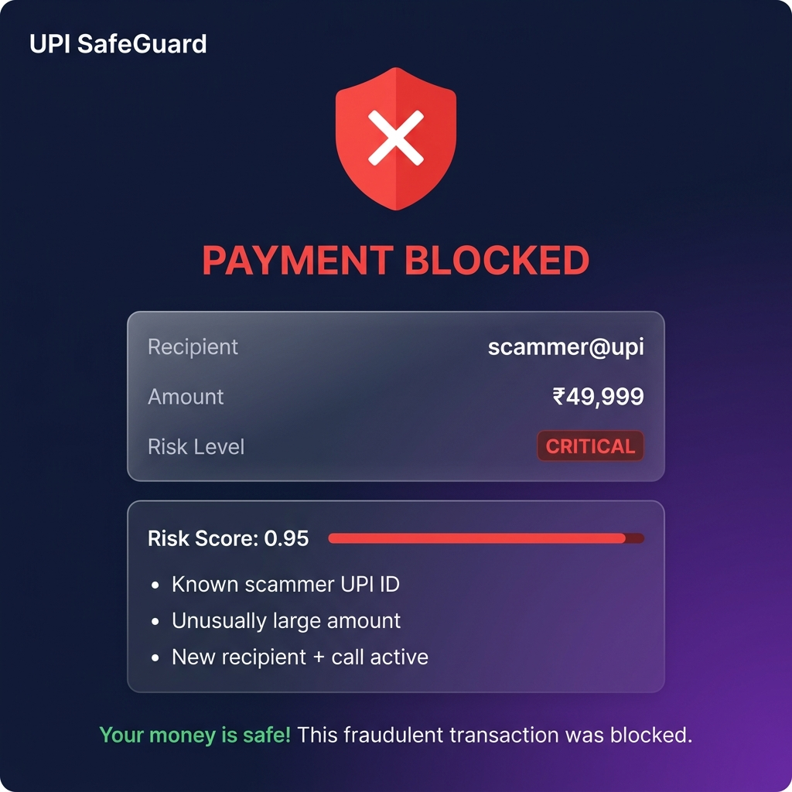
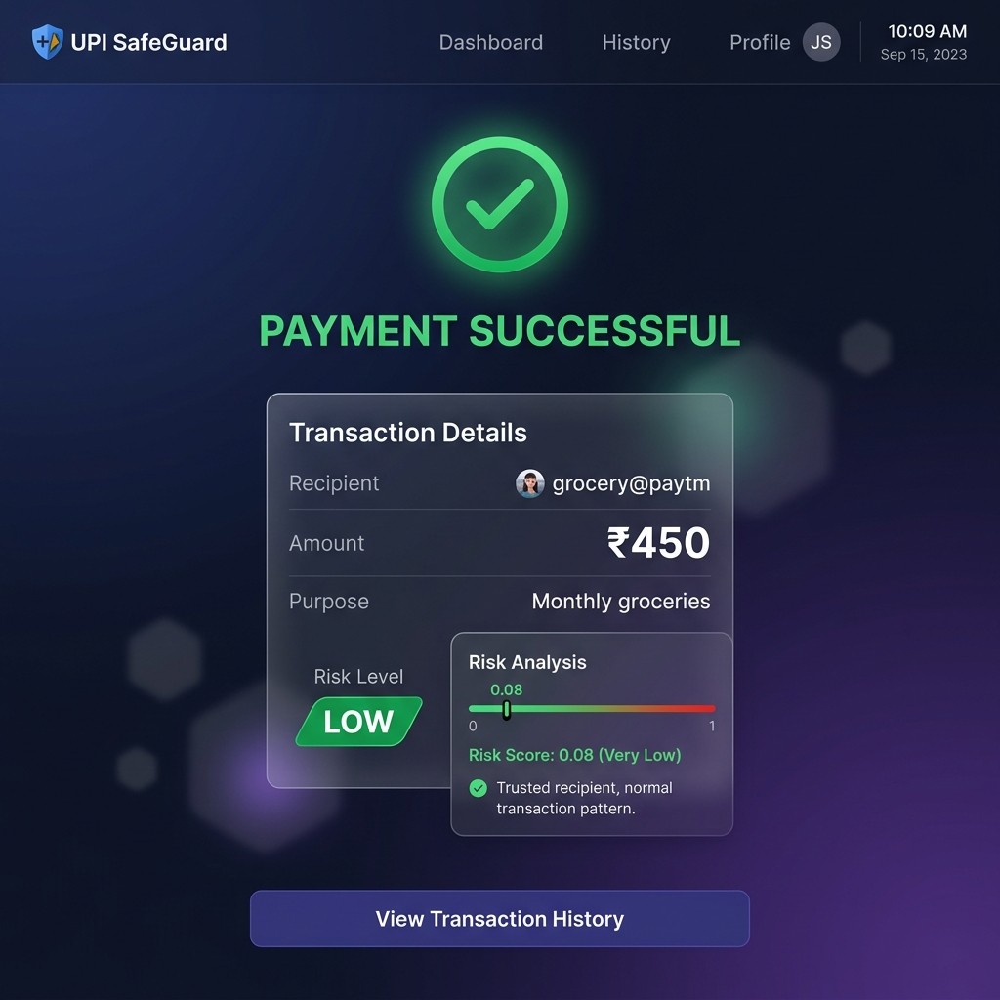
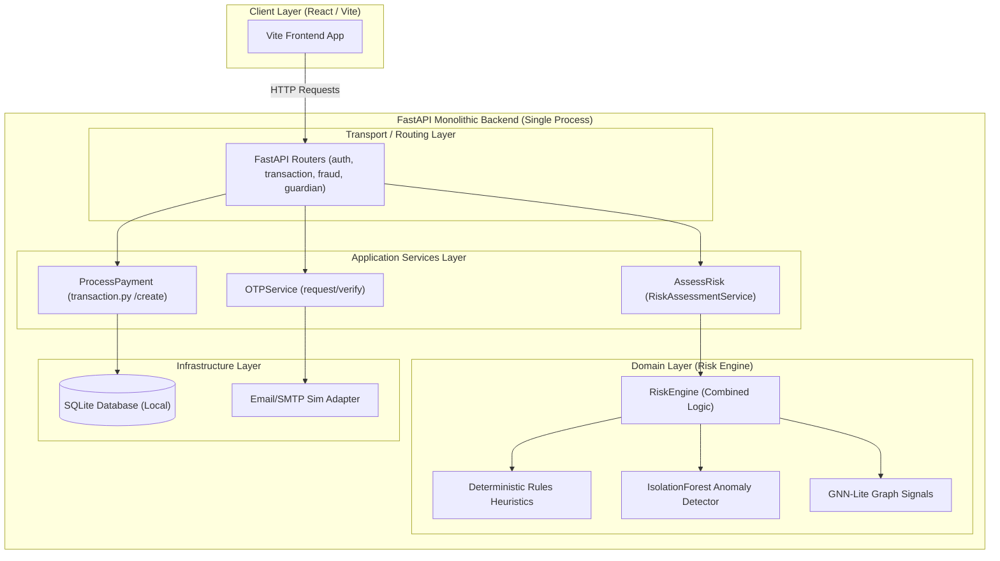
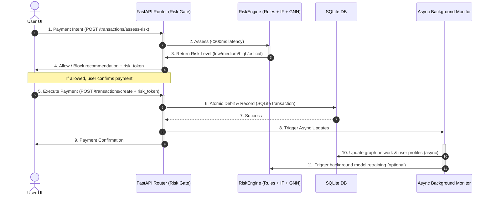

# UPI SafeGuard — a web-based UPI fraud-risk analysis prototype (FastAPI + React/TS)

<p align="center">
  
</p>

<p align="center">
  <strong>Scores UPI transaction risk in real time using rules + IsolationForest anomaly detection + graph-based fraud-ring detection, on simulated data.</strong>
</p>

<p align="center">
  <a href="https://github.com/Jaganravi131/UPI-SafeGaurd/actions/workflows/ci.yml"></a>
  
  
  
  
</p>

---

> [!CAUTION]
> **Prototype only.** No real bank integration and no real customer data — balances/accounts are simulated in SQLite, by design.

---

## 🚫 What it is NOT

- **Not a real UPI payment application** — you cannot transfer actual money.
- **Not connected to NPCI** (National Payments Corporation of India) — it does not interface with the UPI network, PSPs, or banking infrastructure.

---

## 🎬 Demo

> *Screenshots are representative of the application UI.*

<p align="center">
  
  &nbsp;&nbsp;
  
  &nbsp;&nbsp;
  
</p>

| Step | What happens |
|------|-------------|
| **1. Register / Login** | Enter phone → receive OTP (logged server-side in demo mode) → verify |
| **2. Pay a known scammer** | Send ₹49,999 to `scammer@upi` → risk engine scores it **critical** → payment **blocked** |
| **3. Pay a normal merchant** | Send ₹450 to `grocery@paytm` → risk engine scores it **low** → payment **completed** |

<!-- TODO: Replace with your deployed URL after following DEPLOYMENT.md -->
<!-- **🌐 Live Demo**: [https://upi-safeguard.vercel.app](https://upi-safeguard.vercel.app) -->

---

## 🏛️ Architecture

UPI SafeGuard is built as an honest, single-process, **layered modular monolith** backed entirely by a local **SQLite database** (no distributed databases or microservices).

### Layered Monolith Diagram


### Real-Time Risk Gate & Async Monitor Flow
When a payment is initiated, it passes through the real-time **Risk Gate** where rule-based and Isolation Forest checks evaluate behavior in under 300ms. Validated transactions execute atomically, followed by background tasks updating user graphs/profiles.



---

## 🚀 How to Run

### Prerequisites
- Python 3.10+ &nbsp;|&nbsp; Node.js 18+ (for frontend)

### 1. Backend

```bash
cd backend
python -m venv venv
# Windows: venv\Scripts\activate | Linux/Mac: source venv/bin/activate
pip install -r requirements.txt

# (Optional) Re-train/materialize the risk engine artifact.
# A pre-trained 'risk_engine.joblib' is already committed in app/ml/trained_models/
python train_paysim.py

# Start the API server
uvicorn app.main:app --reload --port 8000
```

Swagger docs → [http://localhost:8000/docs](http://localhost:8000/docs)

### 2. Frontend

```bash
cd frontend
npm install
npm run dev
```

App → [http://localhost:3000](http://localhost:3000)

### 3. Tests

```bash
cd backend
python -m pytest -q
```

> [!NOTE]
> **Honest metrics**: Fraud detection is evaluated on a held-out split; run
> `python train_paysim.py --paysim <csv>` with a real PaySim CSV to report
> precision / recall / ROC-AUC. Synthetic-demo numbers are **not** real metrics.

---

## 🛠️ Features Actually Built

| Feature | Description |
|---------|-------------|
| **Risk Scoring** | Rules + IsolationForest anomaly detection + graph-based checks (GNN-lite) |
| **Email OTP** | Generate, deliver (or log in demo mode), verify, expiry enforcement |
| **Transaction History** | Paginated list with risk scores and status filters |
| **Guardian Mode** | Link a guardian with a review threshold for high-risk transactions |
| **QR Scanner** | Parse merchant QR codes and verify safety |
| **Admin Dashboard** | Model performance, user management, system health |

*Claims of LSTM, agentic AI, 12-language TTS, or fixed accuracy metrics were not honestly built and have been removed.*

---

## 🚢 Deployment

See **[DEPLOYMENT.md](DEPLOYMENT.md)** for step-by-step instructions to deploy:
- **Backend** → Render (free tier, Docker)
- **Frontend** → Vercel (free tier, Vite)

A [`render.yaml`](render.yaml) blueprint is included for one-click Render setup.

> Without SMTP/Twilio configured, OTP uses a dev-fallback that logs the code
> server-side only. Registration still works — check backend logs for the OTP.

---

## 🐳 Docker

```bash
docker-compose up --build
# Backend → http://localhost:8000
# Frontend → http://localhost:3000
```

---

## 🏷️ Repository Metadata
- **Description**: UPI SafeGuard is a real-time UPI transaction risk-analysis prototype using a FastAPI backend and a React/TypeScript frontend. It integrates rules, Isolation Forest anomaly detection, and graph-based signals to score simulated transaction risk.
- **Topics**: `upi`, `fraud-detection`, `fastapi`, `react`, `typescript`, `scikit-learn`, `networkx`, `anomaly-detection`

---

## 📄 License

This project is licensed under the [MIT License](LICENSE). It is intended for educational and demonstration purposes only.
